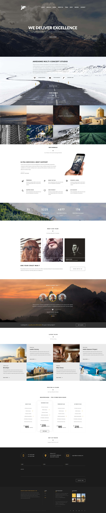

# Maglic-LandingPage
Practice

GH Pages - https://sokolovag.github.io/Maglic-LandingPage/

### The tech stack: HTML (with BEM-naming classes), Less, Gulp as a Less-compilator and tusk-runner, JavaScript.
### Cross-browser compatibility: IE 10+;

# This awesome template designed by: https://www.behance.net/combocoder

### The preview of the project:

